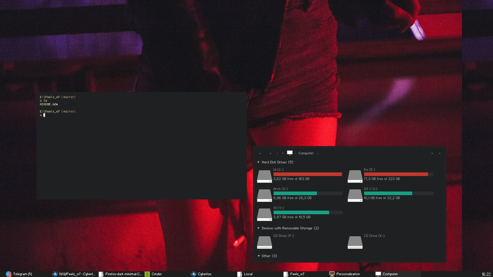

# Feels_w7
Minimal dark compact theme for Windows 7
Initially based on SlanXP2, but alot has been modified.

SlanXP2 goes into %windir%/Resources/Themes

feels.theme goes into AppData/Local/Microsoft/Windows/Themes

Recommended to use with 7+ Taskbar Tweaker.

